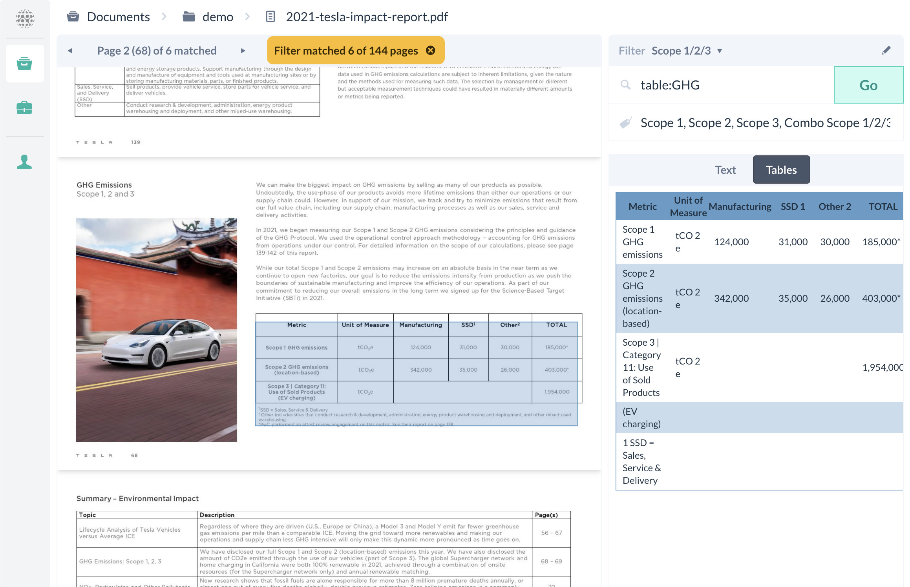

# CRRF Data Extraction Toolkit

A web application for PDF content and table extraction, featuring image-based visual layout analysis, indexed document search, batch processing and extraction result annotation.

## Features

**PDF Processing (t-pdf)**

- 📄 PDF page content understanding using an image-based visualized method, segmenting tables and text boxes
- 🧪 Unit test controlled layout analysis results for quality assurance
- 🚀 High speed analysis: Image processing written in NumPy + scikit-image, achieving 3 page/sec per 1000 <a href="https://www.geekbench.com" target="_blank">Geekbench score</a> on a single core.
- 🧬 Conversion from PDF files to structured JSON

**Documents Management**
- 📁 Manage a repository of folders of PDF files
- 🔎 Search using keywords and phrases (ngram) inside the PDF documents, designed for numerical value extraction, with:
    * "double quoted phrases"
    * -excluded_words
    * -"excluded phrases"
- 🏷️ Manage a list of persisted search queries, known as "filters", for quick recalling and batch execution. Associate a search query with a list of tags.
- Fully asynchronous task processing, with configurable number of parallel processes

**Batch Processing, User and Annotation Projects**
- 💼 Create batch processing projects to run a selection of "filters" against a selection of folders and documents, generating a collection of segments in JSON format for download.
- 🏷️ Convert the segments into an annotation project
- 📱 A mobile-browser-friendly infinite-scrolling web app for annotating small segments collected from the documents
- 🧑‍💼 Invitation based user registration system, with admin-accessible document managements and user-accessible annotation

## Developing

Clone the repo:

    $ git clone git@github.com:os-climate/crrf-det.git

**Frontend**

We use <a href="https://vitejs.dev" target="_blank">Vite</a> as our frontend tooling for a <a href="https://reactjs.org" target="_blank">React</a> based frontend. To start the frontend, first install <a href="https://nodejs.org/en/" target="_blank">Node.js</a> in your local environment, and make sure the `npm` command is available. Then:

    $ cd crrf-det/src/fe
    $ npm install
    $ npm run dev

After dependency installation, this will launch the frontend server at <a href="http://localhost:5173/" target="_blank">http://localhost:5173/</a>. Note that the default setup in the repository assumes that you run the development on `localhost`. For instructions to deploy the program to another host, consult the **Deployment** section.

**Backend**

We use <a href="https://www.docker.com" target="_blank">Docker</a> as the backend development environment. To launch the backend, first install the respective Docker edition for your local environment. Then:

    $ cd crrf-det
    $ docker-compose build
    $ docker-compose up

This will bring up a <a href="https://sanic.dev/en/" target="_blank">Sanic</a> based backend at port `8000`, with a <a href="https://redis.io" target="_blank">Redis</a> database at port `6379`. Additionally, it creates the `dev-data` folder (at the same level of `docker-compose.yml`) for persisted data. No information is persisted in the Redis database. It is used primarily for running and keep tracking of asynchronous tasks.

Note our setup uses an x86_64 base image.

You need a first admin user to use any of the functionalities. To create one, do it manually inside the container:

    $ (sudo) docker exec -ti crrf-det-be-1 bash
    # python
    >>> import data.user
    >>> data.user.add('admin', 'password', 0)
    >>> quit()

Visit <a href="http://localhost:5173/" target="_blank">http://localhost:5173/</a> and login using the user. Note the argument `0` at the end of the call refers to the level of the user. You need level `0` (the highest) to access PDF documents and project functionalities. Levels > 0 can only access the annotation app.

## Tests

Unit tests currently only covers the PDF page layout analysis portion of the code, which is in Python. Once you have the development containers setup, you can then go inside and start the tests:

    $ (sudo) docker exec -ti crrf-det-be-1 bash
    # python -m unittest

The tests only guarantees that the layout analysis code, including the portion that breaks columns, rows, and eventually guess the location of the table, is working as intended.

## Deployment

We have written a small script to build size-optimized Docker images for deployment. To build for deployment, first determine the target hostname and port (must be known due to CORS in the backend, and API endpoints in the frontend). Then:

    $ cd crrf-det/deploy
    $ ./build.sh //hostname:port
    $ (sudo) docker save det-be-dist -o det-be-dist.tar
    $ (sudo) docker save det-fe-dist -o det-fe-dist.tar

Note that the `//hostname:port` is only used in building the frontend, by hard-coding the destination API endpoints into the code before compilation. To setup backend handling of CORS, you need to set `HOST_FE_URL` variable in `docker-compose.yml`.

Once you have to two (frontend and backend) images (.tar), copy them to your host, and use the reference `docker-compose.yml` file in the `deploy` folder to set it up.

<strong style="color:red">!!! Security Consideration !!!</strong>

Some environment variables should be changed during the deployment:

      - JWT_SECRET=crrf-det-jwt-SECRET!!!501015
      - PASSWORD_SALT=crrf-det-salt-50-10-15
      - URL_SIGN_SECRET=86c935bc079ba1fef55809e2f575426c

These variables control the encryption of relevant parts. **Using the example as is opens up opportunities for an attacker to generate your authentication token.**

For `JWT_SECRET` and `PASSWORD_SALT` just enter some long enough random strings will be enough. To generate `URL_SIGN_SECRET`, a safe way would be to do it inside the container:

    $ (sudo) docker exec -ti crrf-det-be-1 bash
    # python
    >>> import service.sign
    >>> service.sign.generate_key()

